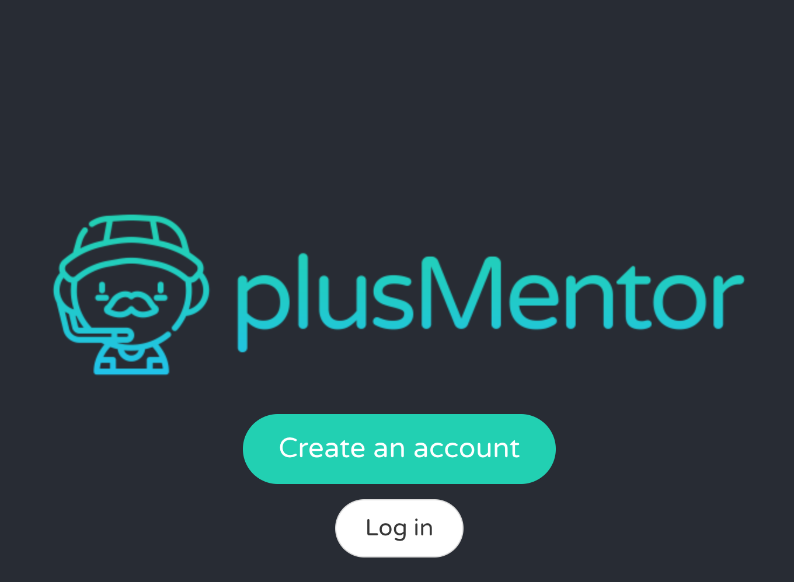
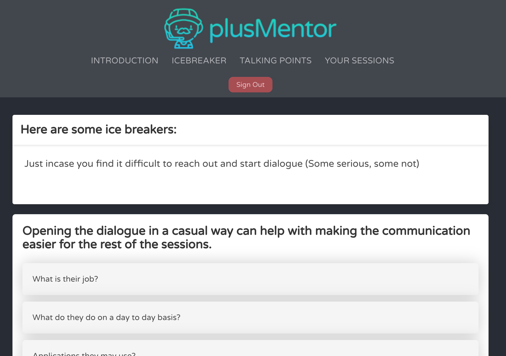
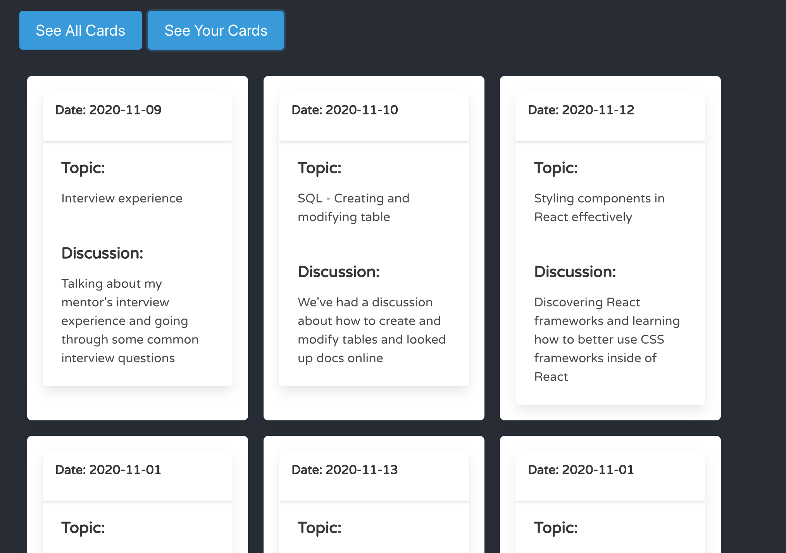

# PlusMentor Back-End

_9-13th November 2020_
_Week 8 at the [School of Code](https://www.schoolofcode.co.uk)_

This was our week 8 week long hackathon at the [School of Code](https://www.schoolofcode.co.uk).

We worked in groups of 4 and had a project brief to **build an app that will enhance the SoC mentoring experience**

My group consisted of Rebecca Jones @Beckster6211, Stefan Kudev @stefankudev & Micahel Swann @michaelfswann, and we worked as an agile team in sprints.

After some discussion we decided to address the problem of mentees not knowing how to approach their mentor and how the mentor/mentee relationship should be. Therefore, we created an app that introduced mentees to the mentor experience with a checklist of things to do (i.e. email your mentor introducing yourself), icebreaker questions, and cards where mentors and mentee could keep track of points to discuss or conversations they had had.

Our Backend and Frontend are both deployed (Heroku & Netlify) - see our [Frontend here](https://plusmentor.netlify.app/)

🤓 **PlusMentor Back-End** 🤩





## Built with

- HTML
- JavaScript
- PostgreSQL
- Node.js
- Express

## Installation

1. Clone the repository

```
https://github.com/randleem/backend-PlusMentor.git
```

2. Navigate to the repo

3. Install the required node modules

```
npm i
```

4. Start the application

```
npm run start
```
